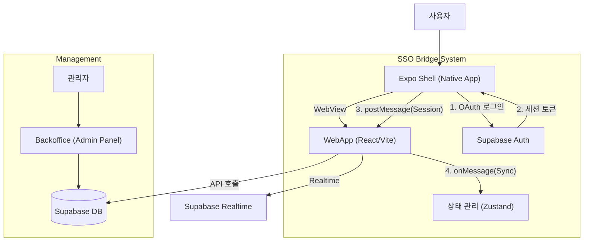

# BridgeApp (브릿지앱)

**브랜드와 아티스트, 크리에이티브, 팬 간의 소통의 장을 제공하는 하이브리드 플랫폼입니다.**

React Native WebView와 웹앱 간의 완벽한 SSO(Single Sign-On) 및 하이브리드 앱 기술을 기반으로, 웹의 유연함과 네이티브 앱의 강력한 기능을 결합하여 최적의 사용자 경험을 제공합니다.

## 🏗 아키텍처

BridgeApp은 **Expo Shell** (Native)과 **WebApp** (WebView)이 유기적으로 연결된 구조입니다.



## ✨ 주요 기능

### 1. 하이브리드 SSO 브릿지
- **Google/Apple OAuth**: 네이티브 레벨의 소셜 로그인 지원.
- **세션 동기화**: 네이티브 앱의 로그인 상태를 WebView와 실시간 동기화.
- **자동 로그인**: AsyncStorage를 활용한 반영구적 세션 유지.

### 2. 실시간 통신 & 알림 (Realtime)
- **실시간 채팅**: Supabase Realtime 기반의 즉각적인 메시지 전송.
- **푸시 알림**: 활동 알림, 시스템 공지 등을 실시간 수신.
- **상태 감지**: 사용자 온라인/오프라인 상태 실시간 반영.

### 3. 성능 최적화 (Performance)
- **무한 스크롤 (Infinite Scroll)**: React Query를 활용한 효율적인 데이터 페칭 및 캐싱.
- **이미지 최적화**: CDN 및 캐싱 전략을 통한 로딩 속도 개선.
- **메모리 관리**: 불필요한 리렌더링 방지 및 리소스 정리.

### 4. 관리자 백오피스 (Backoffice)
- **대시보드**: 주요 지표 시각화 (Recharts).
- **콘텐츠 관리**: 사용자, 프로젝트, 게시물 통합 관리.
- **데이터 분석**: 사용자 활동 및 성과 분석 도구.

---

## 🛠 기술 스택

### 📱 Expo Shell (Native App)
- **Framework**: React Native 0.76, Expo 52
- **Language**: TypeScript
- **Key Libs**: `react-native-webview`, `expo-auth-session`, `expo-secure-store`

### 🌐 WebApp (Main Service)
- **Framework**: React 19, Vite
- **UI Library**: Material-UI (MUI) v6, Framer Motion
- **State Mgt**: Zustand, TanStack Query v5
- **Language**: TypeScript

### 🖥 Backoffice (Admin)
- **Framework**: React 19, Vite
- **UI Library**: Ant Design v5
- **Charting**: Recharts
- **Language**: TypeScript

### ☁ Backend & Infra
- **Platform**: Supabase
- **DB**: PostgreSQL
- **Auth**: Supabase Auth (OAuth, Email)
- **Storage**: Supabase Storage
- **Functions**: Supabase Edge Functions (Deno)

---

## 📂 프로젝트 구조

```bash
BridgeApp/
├── webapp/              # 일반 사용자용 웹 애플리케이션
│   ├── src/pages/       # 페이지 컴포넌트
│   └── src/services/    # API 통신 로직
├── expo-shell/          # 네이티브 앱 컨테이너 (WebView Wrapper)
│   ├── app/             # Expo 라우팅
│   └── lib/             # 네이티브 유틸리티
├── backoffice/          # 관리자용 대시보드
│   └── src/pages/       # 관리자 기능 페이지
├── supabase/            # 백엔드 설정
│   ├── migrations/      # DB 스키마 변경 이력
│   └── functions/       # Edge Functions
└── docs/                # 프로젝트 문서
```

---

## 🚀 시작하기

### 1. 필수 요구사항
- Node.js v18 이상
- npm 또는 yarn
- Expo Go (모바일 테스트용)

### 2. 설치

**의존성 설치:**
```bash
# WebApp
cd webapp && npm install

# Expo Shell
cd ../expo-shell && npm install

# Backoffice
cd ../backoffice && npm install
```

### 3. 환경 변수 설정 (.env)

각 디렉토리(`webapp`, `expo-shell`, `backoffice`)에 `.env` 파일을 생성하고 아래 내용을 설정하세요.

**webapp/.env & backoffice/.env:**
```env
VITE_SUPABASE_URL=https://your-project.supabase.co
VITE_SUPABASE_ANON_KEY=your-anon-key
```

**expo-shell/.env:**
```env
EXPO_PUBLIC_SUPABASE_URL=https://your-project.supabase.co
EXPO_PUBLIC_SUPABASE_ANON_KEY=your-anon-key
# 개발용 웹앱 주소 (로컬 IP 사용 권장)
EXPO_PUBLIC_WEBAPP_URL=http://192.168.x.x:5173
```

### 4. 실행

**WebApp (브라우저):**
```bash
cd webapp
npm run dev
```

**Backoffice (관리자):**
```bash
cd backoffice
npm run dev
```

**Expo Shell (모바일 앱):**
```bash
cd expo-shell
npm start
# 터미널에 나오는 QR 코드를 Expo Go 앱으로 스캔
```

---

## 📚 문서 링크

- [SSO 브릿지 구현 가이드](./SSO_BRIDGE_GUIDE.md)
- [OAuth 네이티브 연동 가이드](./OAUTH_NATIVE_SOLUTION.md)
- [메시지 시스템 개선 사항](./MESSAGE_SYSTEM_IMPROVEMENT.md)
- [이미지 최적화 보고서](./WEEK3_IMAGE_OPTIMIZATION.md)
- [실시간 무한 스크롤 구현](./WEEK4_REALTIME_INFINITE_SCROLL.md)

---

## 🚨 트러블슈팅

**Q. WebView에서 Google 로그인이 안 돼요.**  
A. Google은 보안상의 이유로 일반 WebView에서의 로그인을 차단할 수 있습니다. `expo-shell`의 User-Agent 설정을 확인하거나, 네이티브 방식의 로그인을 사용해야 합니다. (상세 내용은 [OAuth 가이드](./OAUTH_NATIVE_SOLUTION.md) 참조)

**Q. 앱과 웹의 세션이 동기화되지 않아요.**  
A. `window.ReactNativeWebView.postMessage`가 정상적으로 호출되는지 WebApp 콘솔에서 확인하고, Expo Shell의 `onMessage` 핸들러가 메시지를 수신하는지 확인하세요.

---

## 📄 라이선스

MIT License
